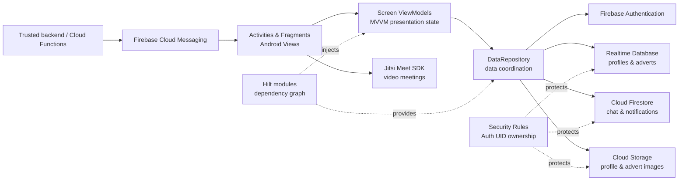

# Gezdir Android

Kotlin Android travel marketplace with Firebase, real-time chat, notifications and video meetings.

Gezdir connects travellers with local guides. Users can publish and browse travel adverts, manage profiles, start one-to-one conversations, receive notifications, and join virtual trips through Jitsi Meet.

## Features

- Email/password registration and sign-in with Firebase Authentication
- Traveller and local-guide profiles
- Travel advert creation, editing, discovery, and removal
- Real-time one-to-one chat backed by Cloud Firestore
- In-app notifications and FCM token registration
- Image upload and delivery with Cloud Storage
- Video meetings powered by Jitsi Meet
- Light and dark themes

## Tech stack

- Kotlin and Android Views with Data Binding / View Binding
- MVVM presentation architecture
- Hilt dependency injection
- Firebase Authentication, Realtime Database, Firestore, Storage, and Messaging
- AndroidX Navigation
- Jitsi Meet SDK
- Picasso and Lottie
- JUnit and Mockito

## Architecture

Activities and Fragments observe screen-specific ViewModels. Hilt builds the dependency graph and injects the shared repository, which coordinates the Firebase SDKs. Firebase Auth UIDs are used as ownership boundaries in the data model and Security Rules.



The current codebase uses a single repository while preserving screen-level ViewModels. Future work can split it into auth, profile, advert, chat, and notification repositories without changing the UI boundary.

## Getting started

### Prerequisites

- Android Studio with Android SDK 36
- JDK 17
- A Firebase project
- A device or emulator running Android 7.0 (API 24) or later

### Firebase configuration

1. Clone the repository.
2. Register `com.example.gezdir` as an Android app in Firebase Console.
3. Copy the downloaded configuration to `app/google-services.json`.
4. Enable Email/Password Authentication and create Realtime Database, Firestore, and Storage.
5. Deploy the checked-in rules and indexes.

See [Firebase setup and security](docs/FIREBASE.md) for the complete setup, deployment, legacy-data migration, App Check, and push-notification notes. The real `google-services.json` is intentionally ignored; `app/google-services.example.json` only shows its expected structure.

### Build and test

```bash
./gradlew test
./gradlew assembleDebug
```

The project can run JVM unit tests without a local Firebase configuration. Launching the app requires a valid `app/google-services.json`.

## Firebase security

Security configuration is versioned in:

- `database.rules.json`
- `firestore.rules`
- `firestore.indexes.json`
- `storage.rules`
- `firebase.json`

Rules deny access by default, use Firebase Auth UIDs for ownership, restrict FCM token writes to the owning user, and limit uploads to authenticated image files below 10 MB. Test rule changes with the Firebase Emulator Suite before production deployment.

The original project stored plaintext passwords in Realtime Database and attempted to send FCM messages with a server key embedded in the client. Both patterns have been removed. Push delivery now requires a trusted backend or Cloud Function.

## Tests

Repository unit tests live under `app/src/test`. They mock Firebase references so repository delegation can be verified without network access. Security Rules should additionally be covered with Emulator Suite tests before production deployment.

## License

This project is available under the [MIT License](LICENSE).
